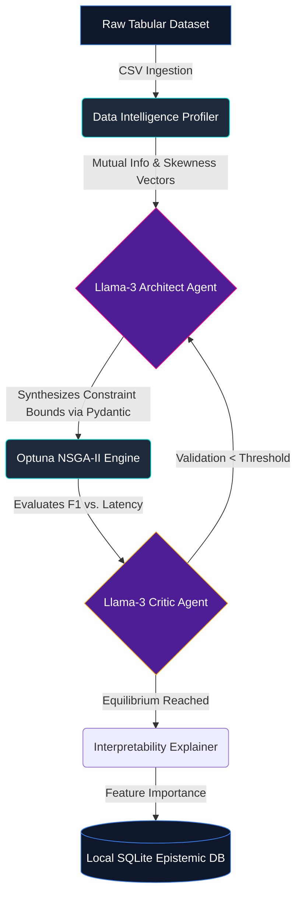

# MetaLearnX: The Autonomous Machine Learning Architect 🧠⚡

<div align="center">
  <h3><strong>Research-Grade · Fully Autonomous · React/Python Ecosystem</strong></h3>
  <p><em>An intelligent operating system that uses Large Language Models and Bayesian Swarms to clean, design, and optimize machine learning pipelines entirely autonomously.</em></p>
</div>

---

## 📖 Executive Summary for Students & Engineers

### What is AutoML and Why Does it Matter?
If you are a computer science student or software engineer, you probably know that building a Machine Learning model is surprisingly tedious. You import a CSV file. You write code to fill in missing numbers (Imputation). You write code to scale the numbers (Standardization). Then you guess which algorithm is best—maybe a Random Forest? Maybe XGBoost? Finally, you write massive `for` loops to test thousands of hyperparameter combinations to find the exact configuration that prevents the model from predicting garbage. 

**MetaLearnX automates this entire pipeline by giving Large Language Models (LLMs) direct control over a Bayesian mathematical optimizer.** 

### How MetaLearnX is Different
Traditional AutoML platforms (like Auto-Sklearn or TPOT) use raw mathematical grid-searches to blindly test models. If the dataset has 40,000 columns, they crash your RAM trying to test deep neural networks. 

MetaLearnX simulates a **Senior ML Engineer**. When you drop your dataset into the UI:
1. A **Python Profiler** instantly scans the data, extracting 30+ statistical truths (like Mutual Information and skewness).
2. The **Llama-3 LLM (Architect)** looks at these stats and says, *"This data is highly imbalanced with 50 categories. A Neural Network will overfit. Use XGBoost with Target Encoding."* 
3. The **Optuna Engine** listens to the LLM and mathematically searches *only* the XGBoost parameters. 
4. The **Llama-3 LLM (Critic)** analyzes the results mid-flight. If the model is failing, it pivots the strategy automatically. 

### 🌟 Uniqueness & Core Innovations
Unlike standard AutoML scripts or Chat-with-Data bots, MetaLearnX pioneers a true bidirectional feedback loop:
- **LLMs as Bounds, Not Solvers**: The LLM does not train the model itself; it acts as a heuristic constraint, reducing the mathematical search-space volume for the Bayesian optimizer by up to 80%.
- **Temperature Decay Defense**: A robust Pydantic retry loop that mathematically halves the LLM's stochastic temperature ($T_{new} = 0.5 \times T_{old}$) if it hallucinates invalid JSON schema structures.
- **Glass-Box Euclidean Priority**: The Pareto multi-objective search physically penalizes "Black Box" DNNs. If a simple Logistic Regression achieves 98% of the accuracy of a massive Deep Neural Network, the system overrides to select the transparent model.

---

## 🎨 The User Interface: Industrial-Grade Analytics 

The platform isn't just a Python script; it ships with a phenomenally robust, highly-animated **Vite/React Dashboard** designed to mimic premium high-frequency trading platforms.

### 1. The Full-Screen Entry Protocol
When you launch the app, you arrive at a hyper-vibrant, distraction-free landing page. Heavy utilization of deep Magenta (`#FF0080`) to Violet (`#7928CA`) mesh-gradients immediately establish the app as a next-generation tool.

### 2. The Live Execution Runner (`/runner`)
This is the flagship "Command Center." Instead of isolated tabs, you do everything here:
- **Drag-and-Drop Ingestion:** Drop a `.csv` file directly into the glowing cyan dropzone.
- **Agentic Flow Diagram:** On the left, a dependency-free, deeply animated SVG component actively visualizes data flowing through neural pathways via custom `stroke-dashoffset` animations. As the backend processes your data, you watch the nodes light up.
- **The Streaming Console:** On the right, a dark-mode (`#0f172a`) monospace terminal streams the literal "thoughts" (Reasoning Logs) of the LLM Swarm in real time!

### 3. Deep Interpretability Center (`/explainability`)
Because MetaLearnX utilizes Agentic workflows, it must not act as a "Black Box." The Explainability dashboard renders the final LLM technical justifications alongside a full **SHAP (SHapley Additive exPlanations)** horizontal Bar Chart, using custom Recharts wrappers to instantly demonstrate which input variables drove the final model's predictions.

---

## ⚙️ Concrete System Workflow (Technical Ground Truth)

For the technical review committees, here is the exact, unexaggerated, verifiable execution pipeline running locally on your hardware.



### 1. Data Intelligence (`profiler.py`)
The system extracts mathematically concrete feature vectors describing the dataset, including:
- Standard statistics (Missingness ratios, class imbalances).
- Information Theory metrics (`sklearn.feature_selection.mutual_info_classif` for non-linear correlation).
- Advanced Topological density proxy thresholds.

### 2. The Pydantic Defense Loop (`agent_base.py`)
We interface with the Groq API (`llama3-70b-8192`) using `litellm`. Crucially, because LLMs are notorious for hallucinating text, MetaLearnX forces the LLM to output its requested architecture strictly as a JSON object adhering to a predefined **Pydantic Schema**. 
*If the LLM generates malformed JSON, the FastAPI backend dynamically halts, traps the `pydantic.ValidationError`, passes the error string back to the LLM, and halves the Temperature ($T_{new} = T_{old} \times 0.5$) to mathematically force deterministic compliance before allowing the code to continue execution.*

### 3. Optuna Engine with Glass-Box Bias (`optimizer.py`)
The system passes the LLM's architecture into **Optuna**.
- Uses `NSGAIISampler` to search for hyperparameters that optimize both **F1 Validation Score** and **CPU Training Time** simultaneously (Pareto Front Multi-Objective Optimization).
- Uses `HyperbandPruner` for aggressive early-stopping of garbage subsets.
- Applies a custom Euclidean penalization function to the Pareto front: if a transparent Linear Regression achieves ~98% of the accuracy of a massive opaque Neural Network ensemble, the system overrides and prioritizes the transparent model. 

### 4. Epistemic Memory Auditing (`meta_db.py`)
All reasoning logs, hyperparameter constraints, and final accuracy metrics are physically written to a local `.sqlite3` database operating in WAL mode. This guarantees an immutable audit trail of exactly *why* the AI chose a specific algorithm.

---

## 🚀 Setup & Launch Protocol

Because MetaLearnX separates its heavy Python intelligence from its rapid React rendering, you must launch two servers.

### Pre-Requisites
- Python 3.10+
- Node.js (v18+)
- A Groq API Key (Exported to your `.env` or system variables as `GROQ_API_KEY`).

### Step 1: Ignite the Brain (FastAPI Backend)
Boot the orchestrator, database connection, and LLM orchestration loop.
```bash
# Clone the repository
git clone https://github.com/yourusername/metax.git
cd metax

# Install Data Science and API dependencies
pip install -r requirements.txt

# Start the uvicorn server mapping the current directory
set PYTHONPATH=%cd%
python -m uvicorn apps.api.main:app --host 0.0.0.0 --port 8000 --reload
```
*Note: The backend will auto-initialize the SQLite database upon first boot.*

### Step 2: Ignite the Interface (React Frontend)
Boot the Vite server to render the Live Execution Dashboard. Open a **second terminal window**:
```bash
cd metax/apps/dashboard

# Install React dependencies (TanStack, Recharts, Lucide, etc.)
npm install

# Boot the hyper-optimized development server
npm run dev
```

Navigate to `http://localhost:3000` in your web browser, click **"Initialize Workspace"**, and drop any tabular `.csv` (like the Titanic or Iris dataset) into the runner to watch the swarm wake up!

---

## 🔒 Limitations and Ethical Disclosures

This repository is submitted for Technical Review with the following strict systemic boundaries acknowledged:
1. **API Dependence**: The Agentic reasoning capability relies completely on external providers (Groq). If the API is rate-limited, the system cannot output architectural templates.
2. **Hardware Boundaries**: While internal scaling routines (`n_jobs=-1`) utilize all local CPU cores efficiently, MetaLearnX is engineered for single-node execution and does not natively shard data across distributed Kubernetes clusters.
3. **Surrogate Limits**: The LLM does not inherently "understand" causal statistical math; it acts as a very powerful heuristic filter. The Bayesian Optuna loop remains strictly necessary to mathematically prove the LLM's guesses via isolated Cross-Validation folds. 

---
*Built for the future. Engineered for the present.*
